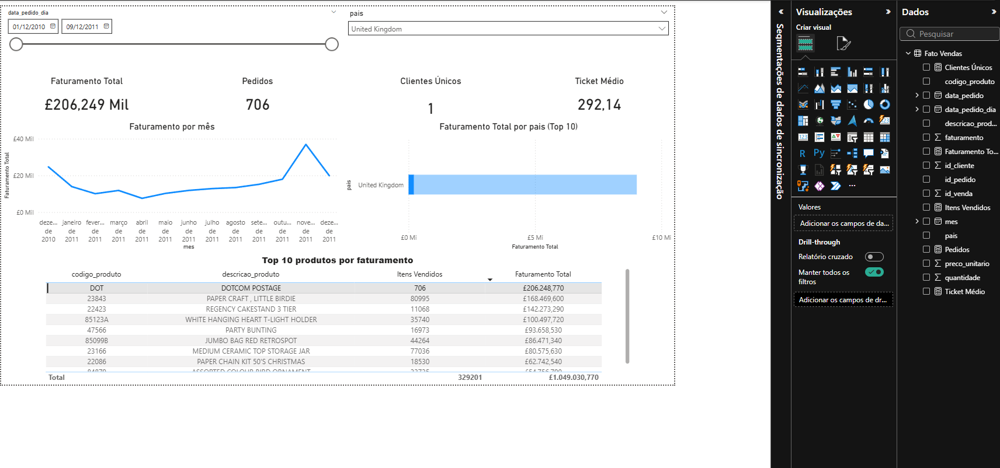
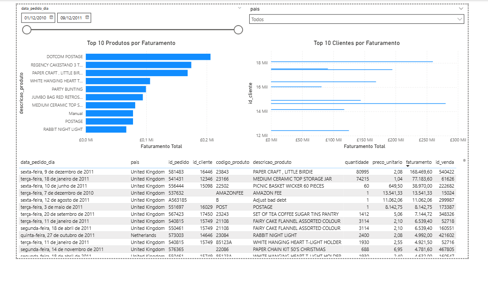

# Dashboard de Vendas (Kaggle → PostgreSQL → Power BI)

Mini pipeline de dados + dashboard no Power BI usando o dataset **Online Retail (Kaggle)**.  
CSV local → carga no **PostgreSQL (Docker)** → consumo no **Power BI** via **views** (camada pronta para BI).

**Principais skills:** PostgreSQL · Docker · Power BI · DAX · Modelagem de Dados · SQL

---

## ✅ O que esse projeto demonstra (para recrutador)

- **PostgreSQL**: criação de schema/tabelas, índices e **views** para camada de consumo no BI  
- **Docker**: ambiente reproduzível (subir o banco com 1 comando)
- **Power BI**: KPIs, filtros, visuais e **medidas DAX**
- **Qualidade de dados**: regras e métricas (taxas) para deixar o dado “confiável” no relatório

---

## 🧱 Arquitetura

**CSV (Kaggle, local) → PostgreSQL (Docker) → Power BI**

---

## 📊 Entregas do dashboard

**KPIs**
- Faturamento Total
- Pedidos
- Clientes Únicos
- Ticket Médio

**Visuais**
- Faturamento por mês
- Faturamento por país (Top 10)
- Top 10 produtos por faturamento

**Filtros**
- Período
- País

---

## ✅ Qualidade de dados (diferencial)

Views no Postgres para padronizar o consumo no BI:

- `ecommerce.fato_vendas` → view final consumida no Power BI  
- `ecommerce.vendas_validas` → camada “limpa” para análise  
- `ecommerce.resumo_qualidade_dados` → métricas (contagens e taxas)

Métricas exibidas no Power BI:
- Taxa Cancelamento/Devolução (%)
- Taxa Registros Descartados (%)

---

## 🖼️ Prints

  



---

## ▶️ Como rodar (local)

### 1) Coloque o CSV (não versionado)
Baixe o dataset e coloque aqui:

- `data/vendas_kaggle.csv`

### 2) Suba o PostgreSQL (Docker)
```bash
docker compose up -d
```

### 3) Crie tabelas/views e carregue os dados
```bash
docker compose exec -T postgres psql -U postgres -d ecommerce -f /scripts/criar_tabelas.sql
docker compose exec -T postgres psql -U postgres -d ecommerce -f /scripts/carregar_dados.sql
```

### 4) Abra o Power BI

Abra:

- powerbi/dashboard_vendas.pbix

Se precisar reconectar:

- Servidor: localhost:5433

- Banco: ecommerce

- View: ecommerce.fato_vendas

## 📂 Estrutura

db/        -> scripts SQL (DDL, carga, views)
docs/      -> prints do dashboard
powerbi/   -> .pbix do relatório
data/      -> CSV local (não versionado)